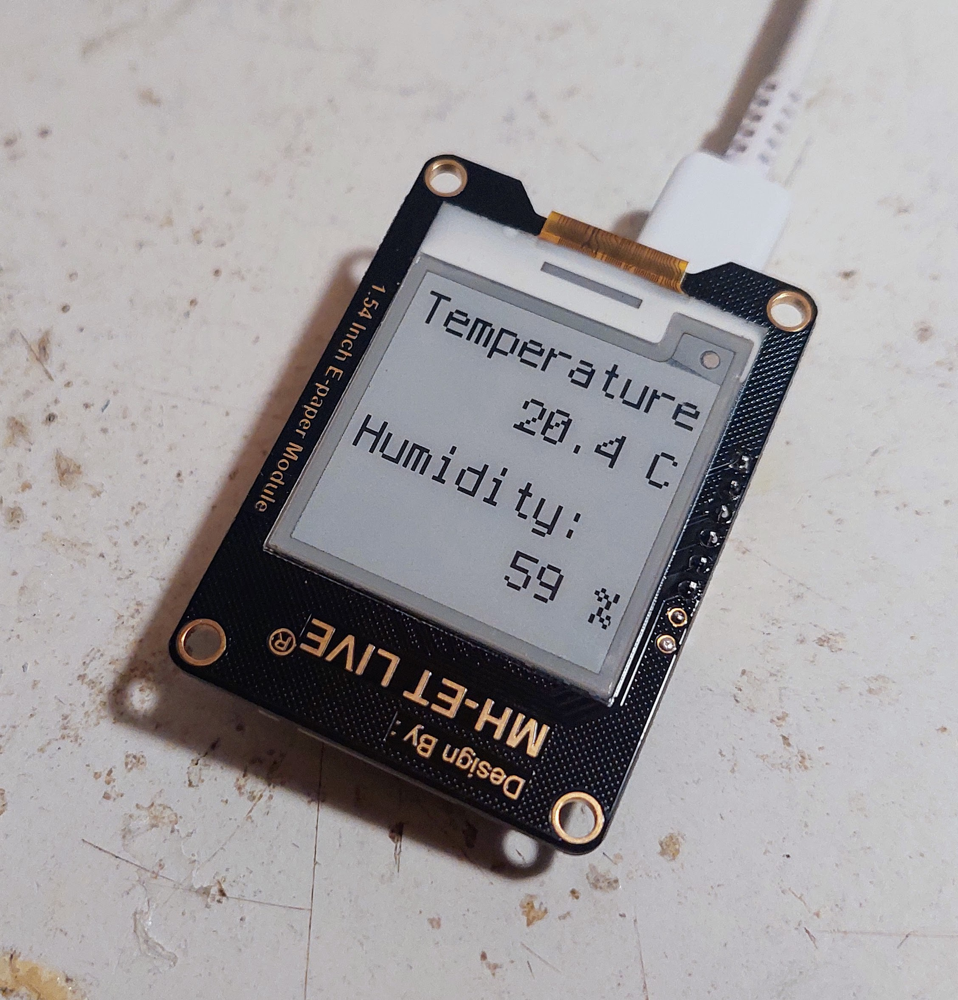
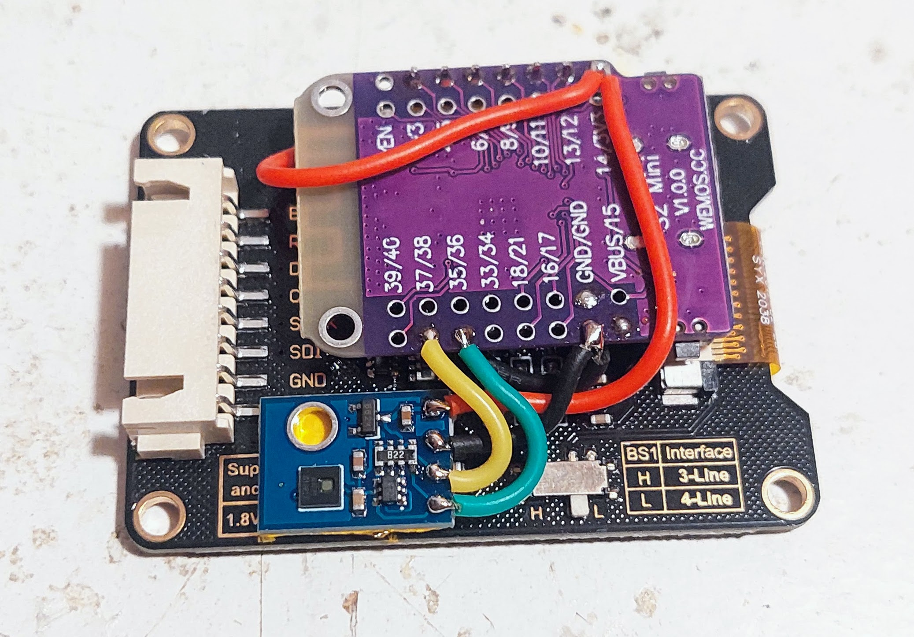
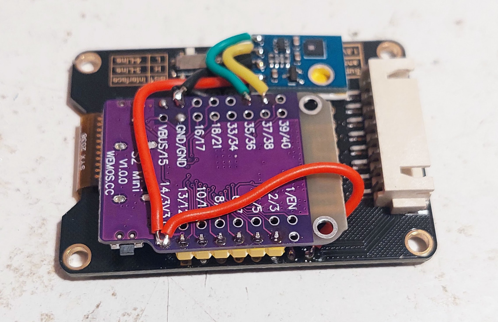

# DIY Temperature and Humidity sensor using EInk display

This DIY sensor uses the temperature sensor is the AHT21.

The display is a 1.54 inches EInk display.

The microcontroller board is the ESP32-S2, running Pyhton (CircuitPython) firmware.

All the components were bought on Aliexpress.

## Pictures

Pictures from prototype on 2023.02.17.

Showing the temperature and humidity values: 

Details of the DIY build. Black board is the 1.54 inches EInk display, the purple board is the ESP32-S2 board (Lolin S2 Mini) and the blue board is the AHT21 sensor: 

